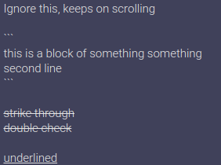

# devRant markdown supports

## To use it, you need to install Tampermonkey

### Download Tampermonkey:

- **Chrome:** [Tampermonkey](https://chrome.google.com/webstore/detail/tampermonkey/dhdgffkkebhmkfjojejmpbldmpobfkfo)
- **Firefox:** [Tampermonkey](https://addons.mozilla.org/en-US/firefox/addon/tampermonkey/) or [Greasemonkey](https://addons.mozilla.org/en-US/firefox/addon/greasemonkey/)
- **Opera:** [Tampermonkey](https://addons.opera.com/en/extensions/details/tampermonkey-beta/)
- **Other:** [Tampermonkey](https://tampermonkey.net/) or [Greasemonkey](https://addons.mozilla.org/en-US/firefox/addon/greasemonkey/) (follow instructions there)

## Then, install the user-script here:

https://github.com/devTeaa/devrant-markdown/raw/master/markdown-support.user.js

Currently the markdown support is only bold, underlined, italic, strikethrough
Please check https://guides.github.com/features/mastering-markdown/ on how to use it
